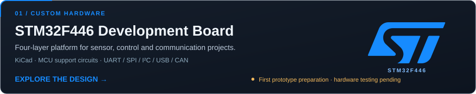
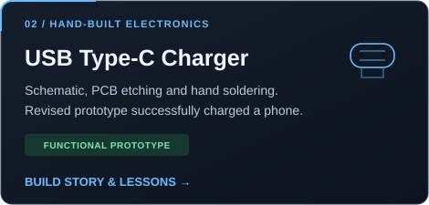

# Hi 👋, I’m Arnold Ackom Oduro

M1 student in **Bionanotechnology and Microelectronics at JUNIA ISEN, Lille**, with interests in embedded electronics, PCB design and analog IC design.

I design circuits and document the decisions, simulations and tests behind them. My current projects include a four-layer STM32 development board and a CMOS amplifier for strain-gauge bridge readout.

## 👋 About me

I enjoy taking an electronics project from a schematic to a prototype, then using measurements and debugging to improve it. My experience includes PCB design in KiCad, prototype assembly and circuit simulation in Cadence Virtuoso.

- 🌍 From **Ghana**, now based in **Lille, France**, through the **KNUST / JUNIA 3+2 programme**.
- 🔧 Developing a **[four-layer STM32F446 board](https://github.com/ackom-a-o/stm32f446-development-board)**; hardware testing is the next stage.
- 🔬 Completed nominal simulations of a **[CMOS strain-gauge bridge amplifier](https://github.com/ackom-a-o/cmos-strain-gauge-amplifier)**; design documentation is being added to the repository.
- 🌱 Strengthening my **C/C++ and STM32 firmware skills**, learning **Python**, and improving my **French**.
- 🎯 Seeking a **3–4-month internship from May 2027** in embedded electronics, PCB design, hardware validation, electronics R&D or microelectronics.

## 🛠️ Core stack

**Firmware & development**

  
  
  
  
  

**Hardware design & testing**

  
  
  

**Microcontrollers**

  
  

**Interfaces & protocols**

  
  
  
  
  

## Featured work

  

  
  

